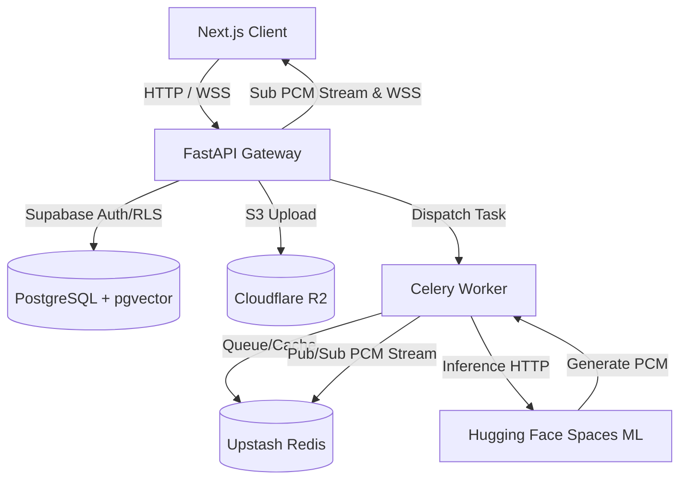

# EchoSync AI: Neural Zero-Shot Voice Synthesis Engine

[](https://github.com/ShantanuDas15/EchoSync-AI/actions/workflows/ci.yml)
[](https://github.com/ShantanuDas15/EchoSync-AI/actions/workflows/ci.yml)
[](https://opensource.org/licenses/MIT)

> State-of-the-art zero-shot voice cloning and text-to-speech engine optimized for low-latency streaming and high-fidelity prosody alignment.

---

## 🏛️ Executive Architecture Summary

EchoSync AI decouples speaker identity extraction from acoustic spectrogram generation and neural vocoding. Built as a decoupled monorepo, the platform operates efficiently across free-tier cloud environments.



* **Frontend UI (Vercel):** Next.js 14 App Router, Clerk Auth, Web Audio API recorder, WaveSurfer.js playhead tracking.
* **API Control Plane (Render / Koyeb):** FastAPI Gateway (<180 MB RAM memory footprint) handling WebSockets, JWTs, & rate limiting.
* **Task Broker & Cache (Upstash Redis & Celery):** Asynchronous task orchestration and token-bucket DLQ queues.
* **ML Inference Engine (Hugging Face Spaces):** ONNX FP16 quantized model runtime (GE2E Speaker Encoder + FastSpeech 2 + HiFi-GAN Vocoder) running on CPU nodes.
* **Persistence & Object Vault:** Supabase PostgreSQL (`pgvector` for 256-d d-vectors) & Cloudflare R2 (S3 API).

---

## 🚀 5-Minute Quickstart (Docker Compose)

The easiest way to boot the entire stack locally is via Docker Compose.

### 1. Repository Setup

```bash
# Clone the repository
git clone https://github.com/ShantanuDas15/EchoSync-AI.git
cd EchoSync-AI

# Copy environment templates
cp .env.example .env
cp backend/.env.example backend/.env
cp frontend/.env.example frontend/.env.local
```

### 2. Boot the Stack

```bash
# Spin up FastAPI, Celery, Redis, and ML Inference containers
docker compose up --build -d
```
* **API Gateway (Swagger Docs)**: `http://localhost:8000/api/v1/docs`
* **ML Inference Container**: `http://localhost:8001`

### 3. Frontend Development Server

```bash
cd frontend
npm install
npm run dev
```
* **Dashboard UI**: `http://localhost:3000`

---

## 📚 Repository Documentation

All comprehensive project specifications, phase execution blueprints, system architecture topographies, and directory structures have been organized into the [`docs/`](docs/) directory:

* 📐 [Technical Architecture & System Design Spec](docs/specifications/echosync_ai_voice_cloning_project_spec.md)
* ⚡ [Master Tech Stack Specification](docs/architecture/TECH_STACK.md)
* 📁 [Repository Directory Structure Specification](docs/architecture/PROJECT_STRUCTURE.md)
* 🚀 [Phase 1 Development Execution Plan](docs/plans/PHASE_1_DEVELOPMENT_PLAN.md)
* 📡 [Phase 2 Async & WebSocket Execution Plan](docs/plans/PHASE_2_DEVELOPMENT_PLAN.md)
* 🛡️ [Phase 3 CI/CD & Security Execution Plan](docs/plans/PHASE_3_DEVELOPMENT_PLAN.md)

---

## 🤝 Contributing

We welcome contributions from the community! Please read our [Contributing Guidelines](CONTRIBUTING.md) to get started.
* Found a bug? Open an issue using our [Bug Report Template](.github/ISSUE_TEMPLATE/bug_report.md).

---

## 🔐 Security & Environment Variable Policy

* No raw `.env` files or secret credentials are tracked in Git.
* Refer to `.env.example`, `backend/.env.example`, and `frontend/.env.example` for environment variable configuration before deploying to production.

---

## ⚖️ License

[MIT License](LICENSE)
